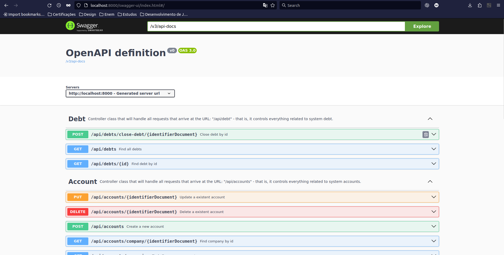
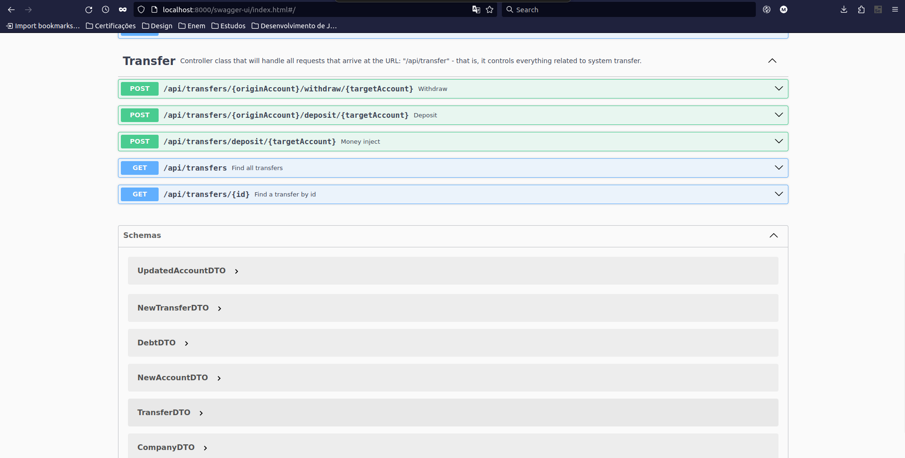
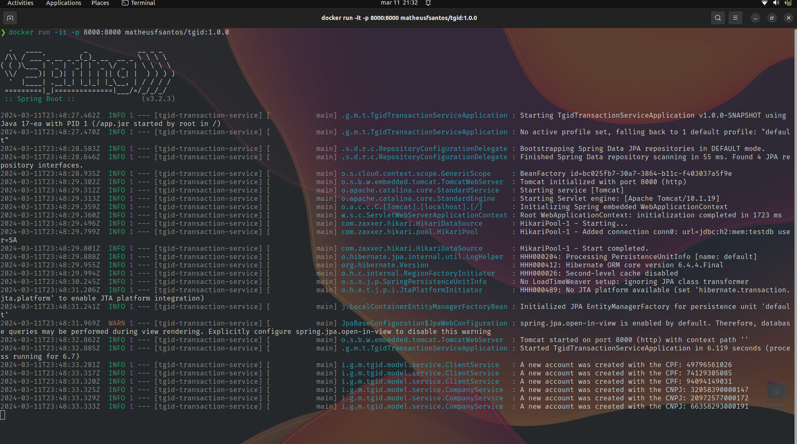

# TGID - Tecnical Test

Olá, me chamo Matheus e seja muito bem vindo a minha solução para o teste técnico para a vaga de Desenvolvedor Java Júnior! 👏 🎉

De primeiro momento já venho agradecer pela equipe de recrutamento da TGID de ter me dado a oportunidade de poder participar e avançar para uma etapa de testes para poder demonstrar minhas habilidades como desenvolvedor back-end, ainda mais de poder realizar o teste com minha linguagem de programação favorita (sem querer ser evangelista de linguagem de programação) que é o Java (+ Spring).

Me dediquei ao máximo a este projeto, virei parte da noite fazendo ele + o resto do outro dia inteiro, mas o resultado final ficou da forma que deveria ficar, acredito que foi um teste que me tirou bastante da minha zona de conforto para conseguir completar o projeto, tentei usar o máximo dos meus conhecimento para entregar um código clean, de fácil manutenção e com testes unitários (pelo menos alguns, afinal estou estudando isso e vejo o quão importante é)...

Enfim, sem mais delongas, vamos para o que me foi proposto:

##
### 🎯 - Project Goal

A idéia central do projeto era criar um sistema de transação monetária, onde tinhamos 2 cenários:

1. Conta padrão: CPF - 11 caracteres;
2. Conta Empresarial: CNPJ - 14 caracteres.

Claro que, ao dar essa especificação, poderia simplesmente criar 2 classes, porém, note que, quando estudamos orientação a objetos, a fundo mesmo, temos um conceito interessante, a **herança**, com ela podemos evitar de escrever classes do tamanho da lua, podemos criar uma *superclasse* que contém todos os atributos bases de uma conta e uma outra (no cenário do teste 2 outras classes) que contém somente os dados importantes: CNPJ e CPF.

Voltando para a especificação, o que eu entendi ao ler mais de 10x a especificação é:

*~ "Crie um sistema financeiro, onde uma conta do tipo cliente possa depositar dinheiro para outras contas do tipo cliente, um sistema onde o cliente possa "pedir uma graninha" para algumas empresas cadastradas no sistema - e que, no ato de devolução do dinheiro a essa empresa, seja cobrado uma taxa adicional desse cliente (que deixei em um valor fixo de 4% por débito), e como requisito bônus (esse criado por mim), tenha um sistema de "Lava Jato" onde você possa injetar dinheiro em uma conta existente"*

##
### 🛠️ - Técnologias utilizadas

- Java (+ Spring boot 3.x);
- H2 database (banco de dados em memória);
- Docker/DockerHub (para criar uma imagem do back-end e puxar na rede);
- Git/GitHub (versionamento);
- Swagger (documentação);
- JUnit Jupiter (testes unitários);
- WebHook (WebHook AUHDASHD);
- RESTer (extensão no firefox para teste de api);

##
### ‍💻 - Ressalvas de Desenvolvimento

Nesse projeto, tentei sair totalmente da minha zona de conforto, usando herança, vários conceitos de programação que aprendi ao realizar o curso de POO da ITA, ou estou aprendendo, realizando o curso de Introdução da Teste de Software da USP, e um fato que achei bastante curioso é o fato de sempre estarmos tentendo a encaixar o famoso:

~~~ java
@Entity
@Table(name="tb_random_class")
public class RandomClass {
  
  vvvvvvvvvvvvvvvvvvvvvvvvvvvvvvvvvvvvvvvvvvvvvvvvvv

  @Id
  @GeneratedValue(strategy=GenerationType.AUTO)
  private UUID id;

  ^^^^^^^^^^^^^^^^^^^^^^^^^^^^^^^^^^^^^^^^^^^^^^^^^^
  ...
}
~~~

Em todas as classes, porém, se pararmos para analisar bem (nesse cenário, e em vários outros), não precisamos utilizar o id, podemos utilizar campos que tem o mesmo sentido, no cenário do teste, pude usar o CNPJ e o CPF para informar que esses sim são o id de cada conta, afinal, CNPJ e CPF são dados imutáveis, e todos nós temos o nosso na ponta da lingua.

Acho que o que mais gostei de fazer, foi pensar em uma estratégia para desenvolver um "schema" de banco de dados (claro que por fazer tantas vezes já ficou meio que automatizado) que fosse o menos redundante possível, utilizando as 3FN e tudo mais.

Além do fato das regras de negócio, que, seloko, foi uma das regras de negócio mais insanas que já fiz em toda minha longa carreira de programador (2 anos :)), não em quesito dificuldade, mas sim em quesito diversão, posso afirmar com todas as letras que, até então, esse foi o teste mais divertido que já realizei!

##
###### 📜 - Documentação

Referente a documentação, eu utilizei o swagger, como já explanei antes, e ela é possivel de se encontrar em: ```base_url/swagger-ui/index.html```, o seu visual deverá ser mais ou menos assim:




Obs.: bonita essa interface do swagger slc UAHSDHAS.

##
###### 📜 - Considerações finais

Acredito que consegui entregar o que foi proposto, mesmo com pouco tempo me dediquei ao máximo, entreguei meu 110% em prol desse teste, por mais que não consegui entregar tudo da forma que queria, ex.: com uma cobertura maior de testes (até porque estou estudando sobre esse assunto atualmente), utilizando as técnicas que estou aprendendo cada dia mais, porém, consegui implementar todo o resto da forma que me foi proposta, com a tecnologia preferencial da empresa (que também é a minha).

Acredito que com esse teste eu já consegui tirar vantagem em algo: me tornei um programador melhor, mais centrado na regra de negócio e aprendi a mergulhar de cabeça em um projeto.

Espero, do fundo do meu coração, conseguir ser aprovado para uma próxima etapa de entrevistas, e se tudo correr bem, ser aprovado para essa vaga e agregar valor a empresa.

Enfim, espero que tudo corra bem, e muito obrigado pela oportunidade de mostrar as minhas habilidades técnicas, e espero ter a oportunidade de mostras as minhas softskills também.

Até um outro dia guys,
FUI!

##
###### 🐋 - Como rodar o projeto

Para rodar o projeto você pode:

1. Clonar o repo. e abrir o projeto em sua máquina;
2. Usar o Docker e ser feliz.

caso você prefira o docker, assim como eu, é possivel rodar o seguinte comando: ```docker run -it -p 8000:8000 matheusfsantos/tgid:1.0.0```.

Link do dockerhub: https://hub.docker.com/repository/docker/matheusfsantos/tgid/general

o comando no terminal ficará mais ou menos assim:

